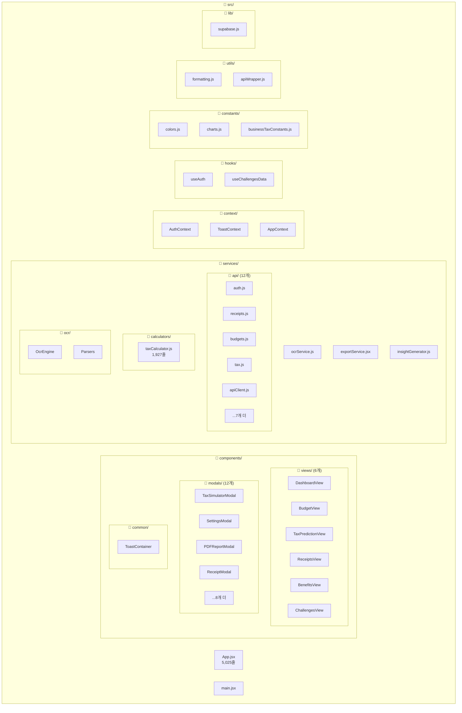
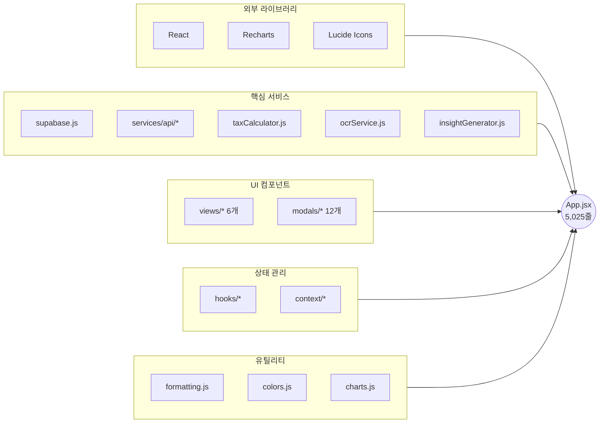
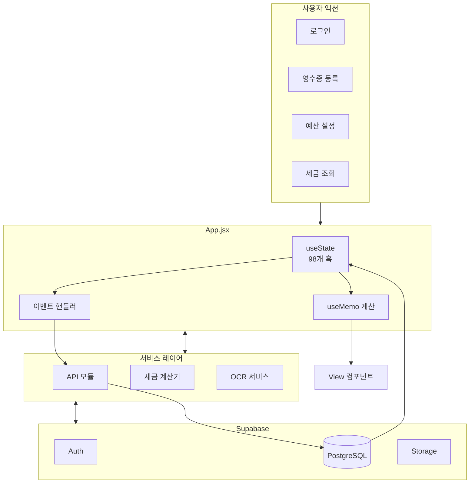
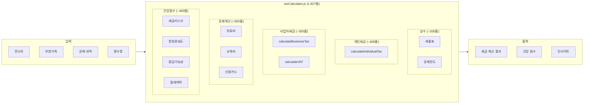
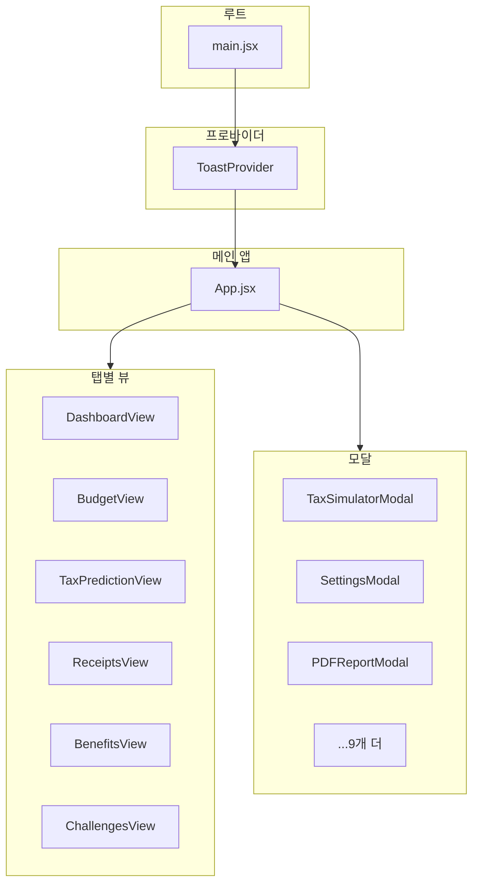
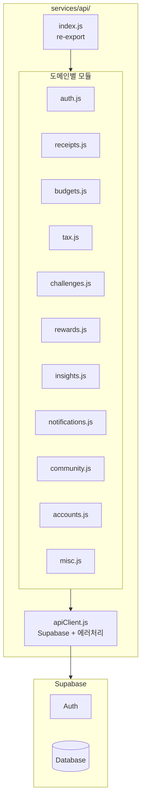
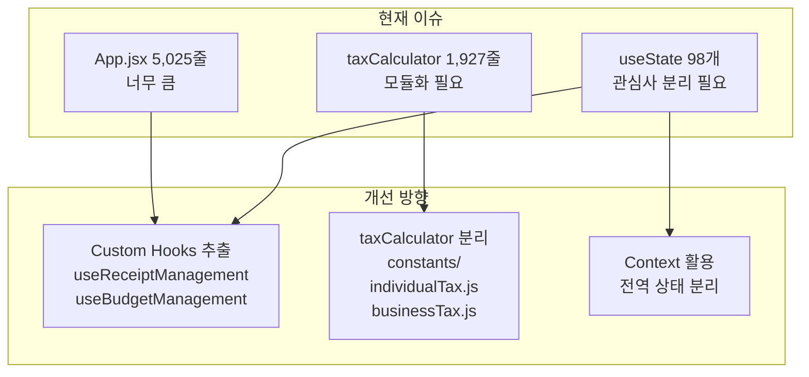
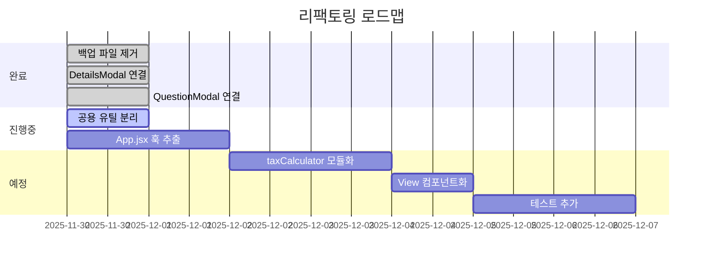

# FINA_R 코드 아키텍처

> 최종 업데이트: 2025-11-30
> 목적: 프로젝트 전체 구조 시각화 및 의존성 파악

---

## 1. 전체 폴더 구조

---

## 2. App.jsx 의존성 맵

---

## 3. 데이터 흐름

---

## 4. 세금 계산 흐름

---

## 5. 컴포넌트 계층

---

## 6. API 모듈 구조

---

## 7. 현재 이슈 및 개선 포인트

---

## 8. 리팩토링 진행 상황

---

## 9. 파일별 줄 수 현황

| 파일 | 줄 수 | 상태 |
|------|------:|------|
| App.jsx | 5,025 | ⚠️ 축소 필요 |
| taxCalculator.js | 1,927 | ⚠️ 모듈화 필요 |
| exportService.jsx | 533 | ✅ 적정 |
| insightGenerator.js | 316 | ✅ 적정 |
| ocrService.js | 181 | ✅ 적정 |

---

*Generated: 2025-11-30*
