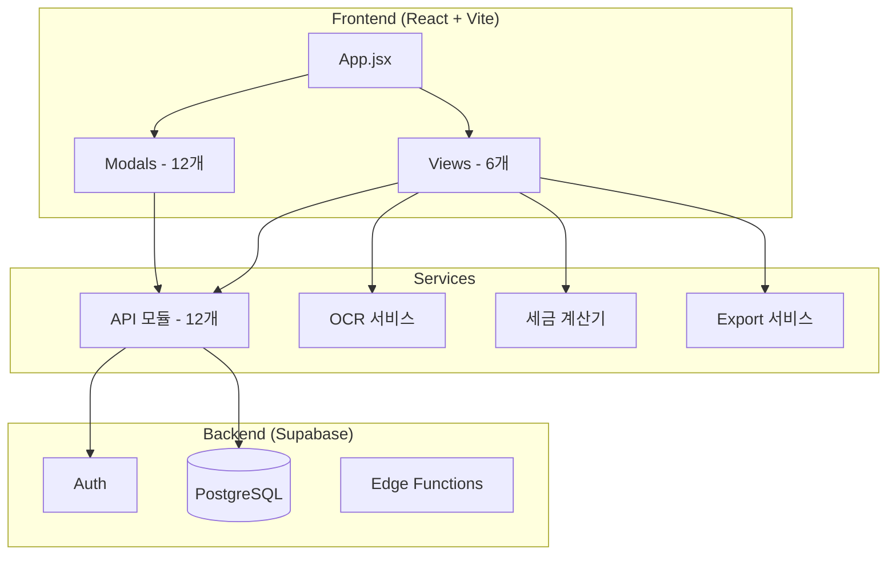
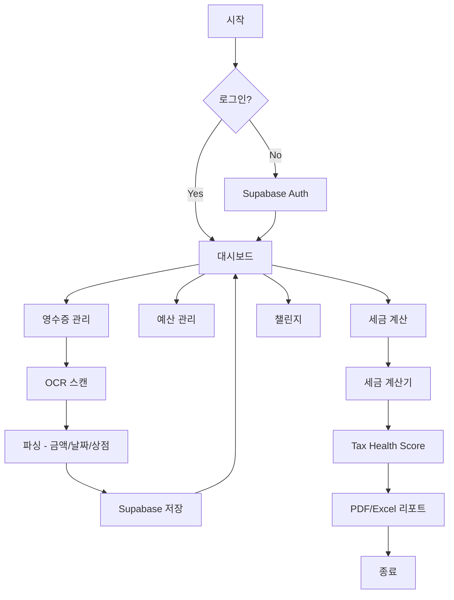

# FINA_R - 한국형 스마트 세금/재무 관리 플랫폼

> 이 문서는 프로젝트를 처음 보는 사람도 이해하고 설명할 수 있도록 작성되었습니다.

---

## 1. 프로젝트 개요

### 1.1 프로젝트 정보
- **프로젝트명**: FINA_R
- **개발 기간**: 2025.10 ~
- **개발 목적**: 한국 세법 기반 종합 재무 관리 플랫폼
- **주요 기능**: 영수증 OCR, 세금 계산, 예산 추적, 게이미피케이션
- **배포 URL**: https://fina-r.vercel.app

### 1.2 배경 및 문제 정의

**왜 이 프로젝트를 만들었나요?**

| 문제점 | 해결 방안 |
|--------|----------|
| 영수증 수작업 입력의 번거로움 | **OCR 자동화**로 영수증 텍스트 자동 인식 |
| 복잡한 한국 세법 이해 부족 | **2024/2025년 기준** 정확한 세금 계산 제공 |
| 연말정산 준비 어려움 | **Tax Health Score**와 AI 인사이트로 절세 전략 제시 |
| 재무 관리 동기 부족 | **게이미피케이션** 요소로 사용자 참여도 향상 |

---

## 2. 요구사항 명세서

### 2.1 기능 요구사항

| 요구사항 ID | 기능 | 설명 | 우선순위 |
|------------|------|------|---------|
| FR-001 | 영수증 OCR | Tesseract.js 기반 한영 텍스트 인식 | 필수 |
| FR-002 | 예산 관리 | 카테고리별 월별 예산 설정 및 추적 | 필수 |
| FR-003 | 세금 계산 | 2024년 소득세율표 기반 계산 | 필수 |
| FR-004 | Tax Health Score | 세금 리스크, 증빙 완성도 점수화 | 필수 |
| FR-005 | 챌린지/미션 | 절약, 영수증 수집 등 게이미피케이션 | 선택 |
| FR-006 | 리포트 내보내기 | PDF/Excel 형식 지원 | 선택 |
| FR-007 | 커뮤니티 | 세금/재무 Q&A, 전문가 상담 | 선택 |

### 2.2 비기능 요구사항

| 요구사항 | 설명 |
|----------|------|
| 성능 | 페이지 로딩 3초 이내 |
| 보안 | Supabase RLS로 사용자별 데이터 격리 |
| 반응형 | 모바일/데스크톱 대응 |

---

## 3. 시스템 아키텍처

### 3.1 전체 구조도



### 3.2 폴더 구조

```
fina_r/
├── src/
│   ├── App.jsx                 # 메인 앱 (5,039줄)
│   ├── components/
│   │   ├── views/              # 탭별 페이지 (6개)
│   │   │   ├── DashboardView.jsx
│   │   │   ├── BudgetView.jsx
│   │   │   ├── TaxPredictionView.jsx
│   │   │   ├── ReceiptsView.jsx
│   │   │   ├── BenefitsView.jsx
│   │   │   └── ChallengesView.jsx
│   │   ├── modals/             # 모달 컴포넌트 (12개)
│   │   └── common/
│   ├── services/
│   │   ├── api/                # API 모듈 (12개)
│   │   ├── calculators/        # 세금 계산기
│   │   ├── ocr/                # OCR 시스템
│   │   └── exportService.jsx   # PDF/Excel 내보내기
│   ├── context/                # 전역 상태 관리
│   ├── hooks/                  # Custom Hooks
│   └── constants/              # 상수 정의
├── supabase/                   # DB 마이그레이션
├── docs/                       # 개발 문서
├── package.json
└── vite.config.js
```

**각 폴더의 역할:**
- `views/`: 탭별 화면 (대시보드, 예산, 세금, 영수증 등)
- `modals/`: 팝업 창들 (세금 시뮬레이터, 설정, PDF 보고서 등)
- `services/api/`: Supabase와 통신하는 API 모듈들
- `services/calculators/`: 세금 계산 로직 (1,927줄)
- `services/ocr/`: OCR 처리 시스템

### 3.3 기술 스택

| 분류 | 기술 | 사용 이유 |
|------|------|----------|
| Frontend | React 18.2.0 | 컴포넌트 기반 UI 개발 |
| 빌드 | Vite 5.0.8 | 빠른 개발 서버 및 빌드 |
| 스타일링 | Tailwind CSS 3.4.0 | 유틸리티 기반 빠른 스타일링 |
| 차트 | Recharts 2.10.4 | React 친화적 데이터 시각화 |
| Backend | Supabase | Auth + PostgreSQL + Edge Functions |
| OCR | Tesseract.js 6.0 | 클라이언트 기반 OCR |
| PDF | jsPDF 3.0.4 | PDF 생성 |
| Excel | xlsx 0.18.5 | Excel 내보내기 |
| 배포 | Vercel | 자동 CI/CD |

---

## 4. 데이터 흐름도

### 4.1 전체 프로세스



### 4.2 세금 계산 흐름


---

## 5. 주요 코드 설명

### 5.1 핵심 파일 목록

| 파일명 | 역할 | 줄 수 |
|--------|------|------:|
| App.jsx | 메인 앱, 상태 관리 | 5,039 |
| taxCalculator.js | 세금 계산 로직 | 1,927 |
| TaxSimulatorModal.jsx | 세금 시뮬레이터 | 41,502 |
| exportService.jsx | PDF/Excel 내보내기 | 533 |

### 5.2 상세 코드 분석

#### 5.2.1 taxCalculator.js

**역할**: 한국 세법 기반 세금 계산

**주요 함수:**

```javascript
// 2024년 소득세율표 (8단계)
const TAX_BRACKETS = [
  { min: 0, max: 14000000, rate: 0.06 },           // 1,400만원 이하: 6%
  { min: 14000000, max: 50000000, rate: 0.15 },    // 5,000만원 이하: 15%
  { min: 50000000, max: 88000000, rate: 0.24 },    // 8,800만원 이하: 24%
  // ... 최대 45%
];

function calculateIncomeTax(income) {
  // 근로소득공제 → 소득공제 → 과세표준 → 세율 적용 → 세액공제
}
```

**쉬운 설명:**
이 파일이 "세금 계산 공장"입니다.
- 연봉(총급여)을 입력받아
- 한국 세법에 따라 각종 공제를 적용하고
- 최종 결정세액을 계산합니다.

#### 5.2.2 OCR 시스템

**역할**: 영수증 이미지에서 텍스트 자동 추출

```javascript
// 파서 구조
AmountParser   → 금액 추출 ("12,500원" → 12500)
DateParser     → 날짜 파싱 ("2025.01.15" → Date)
MerchantParser → 상점명 인식
CategoryParser → 카테고리 분류 (식비, 교통비 등)
```

---

## 6. 실행 프로세스

### 6.1 로컬 실행

```bash
# 1. 프로젝트 폴더로 이동
cd C:\git\fina_r

# 2. 의존성 설치
npm install

# 3. 개발 서버 실행
npm run dev
# → http://localhost:5173

# 4. 빌드
npm run build
```

### 6.2 환경 변수 설정

```env
VITE_SUPABASE_URL=your_supabase_url
VITE_SUPABASE_ANON_KEY=your_anon_key
```

---

## 7. 데이터베이스 구조

### 7.1 주요 테이블 (25개)

| 테이블 | 용도 |
|--------|------|
| profiles | 사용자 프로필 |
| receipts | 영수증 데이터 |
| budgets | 예산 설정 |
| individual_tax_data | 개인 세금 정보 |
| business_tax_data | 사업자 세금 정보 |
| deduction_tracker | 공제 추적 |
| challenges | 챌린지 정의 |
| user_challenges | 사용자별 챌린지 진행 |
| missions | 미션 정의 |
| rewards | 리워드 정의 |

---

## 8. 트러블슈팅

### 8.1 자주 발생하는 오류

#### 오류 1: Supabase 연결 실패
**증상**: 로그인 안됨, 데이터 로드 실패
**원인**: 환경 변수 미설정
**해결**: `.env` 파일에 Supabase URL/Key 설정

#### 오류 2: OCR 인식률 낮음
**증상**: 금액/날짜 추출 부정확
**원인**: 이미지 품질 낮음
**해결**: 고해상도 이미지 사용, 전처리 강화

---

## 9. 향후 개선 방향

### 9.1 현재 한계
1. App.jsx가 5,039줄로 과대 (리팩토링 진행 중)
2. taxCalculator.js 모듈화 필요

### 9.2 추가 예정 기능
1. 상태 관리 라이브러리 도입 (Zustand)
2. TypeScript 마이그레이션
3. 테스트 코드 추가 (Jest, Cypress)
4. 실제 은행 계좌 연동 (오픈뱅킹 API)

---

## 10. 용어 설명

| 용어 | 의미 | 쉬운 설명 |
|------|------|----------|
| 근로소득공제 | 근로자 필요경비 인정 | 연봉에서 자동으로 빼주는 금액 |
| 소득공제 | 과세표준 계산 전 공제 | 세금 계산 전에 빼주는 금액 |
| 세액공제 | 산출세액에서 직접 공제 | 계산된 세금에서 빼주는 금액 |
| Tax Health Score | 세금 건강 점수 | 세금 관리 상태를 점수로 표현 |
| RLS | Row Level Security | 사용자별로 자기 데이터만 접근 |

---

## 11. 포트폴리오 가치

1. **풀스택 웹 개발**: React + Supabase 아키텍처
2. **도메인 지식**: 한국 세법 정확히 구현 (2024년 기준)
3. **다양한 기능**: OCR, 세금 계산, 게이미피케이션
4. **실제 배포**: Vercel 자동 CI/CD
5. **문서화**: 개발 문서 13개 작성

---

*이 문서는 Claude Code의 project-explainer 스킬로 생성되었습니다.*
