# FINA 세금 로직 플로우차트

> 세금 계산 로직을 머메이드 차트로 시각화한 학습 자료입니다.
> taxCalculator.js 기반 (2025년 세법 적용)

---

## 목차

1. [개인 세금 계산 전체 흐름](#1-개인-세금-계산-전체-흐름)
2. [근로소득공제 계산](#2-근로소득공제-계산)
3. [소득세율 구간](#3-소득세율-구간)
4. [신용카드 소득공제 로직](#4-신용카드-소득공제-로직)
5. [사업자 세금 계산](#5-사업자-세금-계산)
6. [간이과세 vs 일반과세](#6-간이과세-vs-일반과세)
7. [Tax Health Score 계산](#7-tax-health-score-계산)
8. [세액공제 항목별 로직](#8-세액공제-항목별-로직)
9. [4대보험 계산](#9-4대보험-계산)
10. [월세 세액공제](#10-월세-세액공제)

---

## 1. 개인 세금 계산 전체 흐름

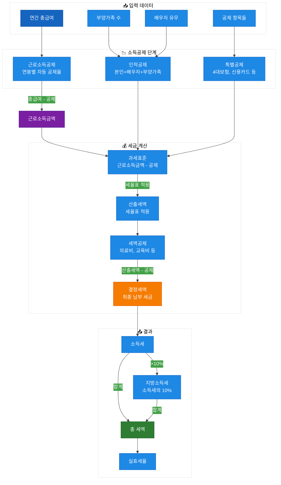

---

## 2. 근로소득공제 계산

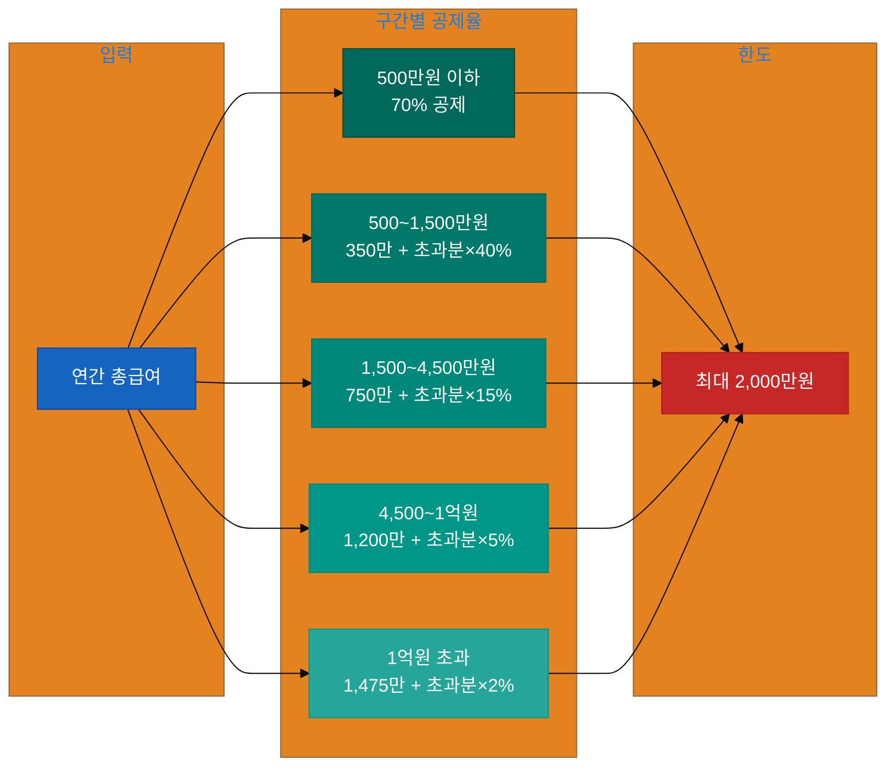

### 공제율 테이블

| 총급여 구간 | 공제율 | 기본공제액 |
|------------|--------|-----------|
| ~500만원 | 70% | - |
| 500~1,500만원 | 40% | 350만원 |
| 1,500~4,500만원 | 15% | 750만원 |
| 4,500만~1억원 | 5% | 1,200만원 |
| 1억원 초과 | 2% | 1,475만원 |

---

## 3. 소득세율 구간


### 세금 계산 공식

```
산출세액 = 과세표준 × 세율 - 누진공제액
```

**예시**: 과세표준 3,000만원
```
= 3,000만원 × 15% - 126만원
= 450만원 - 126만원
= 324만원
```

---

## 4. 신용카드 소득공제 로직

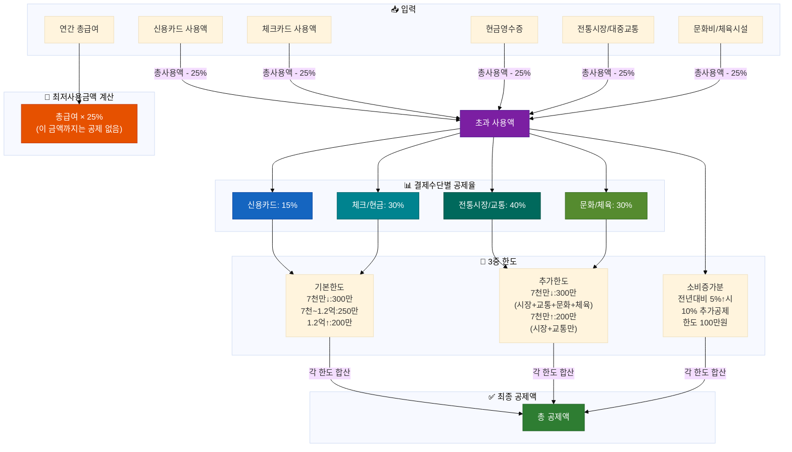

### 공제 순서 (중요!)

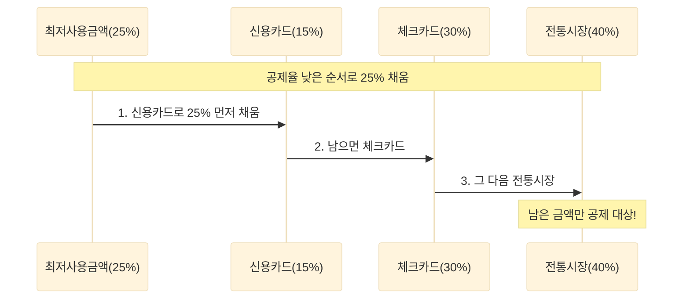

---

## 5. 사업자 세금 계산

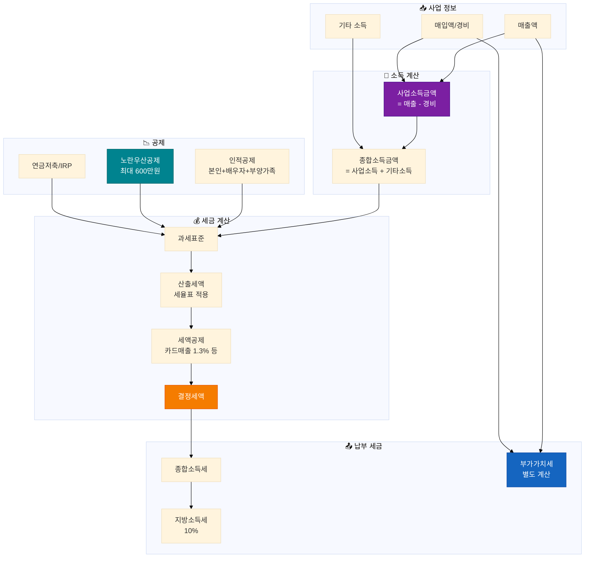

---

## 6. 간이과세 vs 일반과세

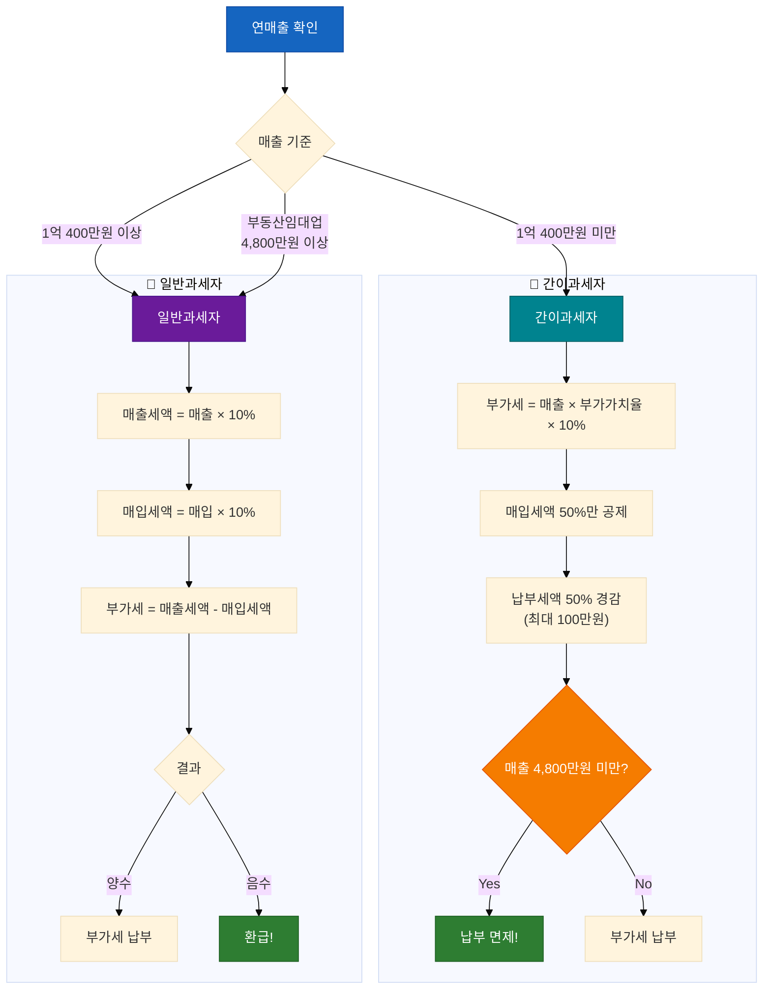

### 업종별 부가가치율

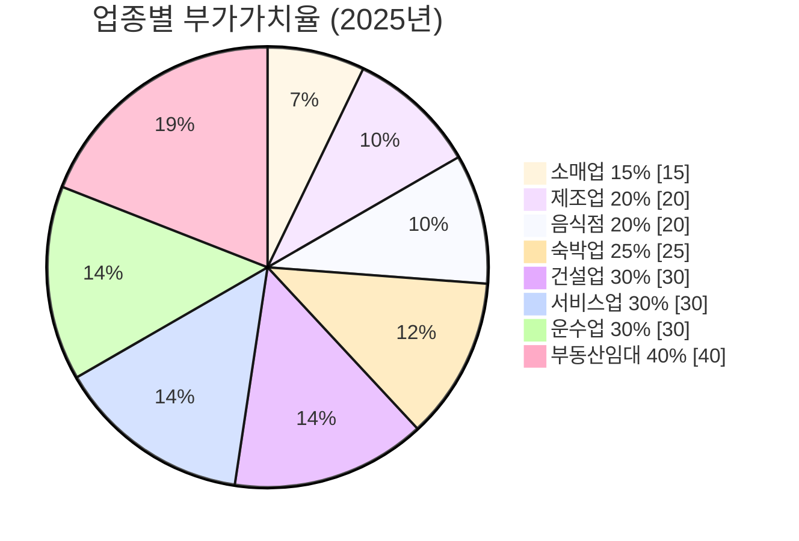

---

## 7. Tax Health Score 계산

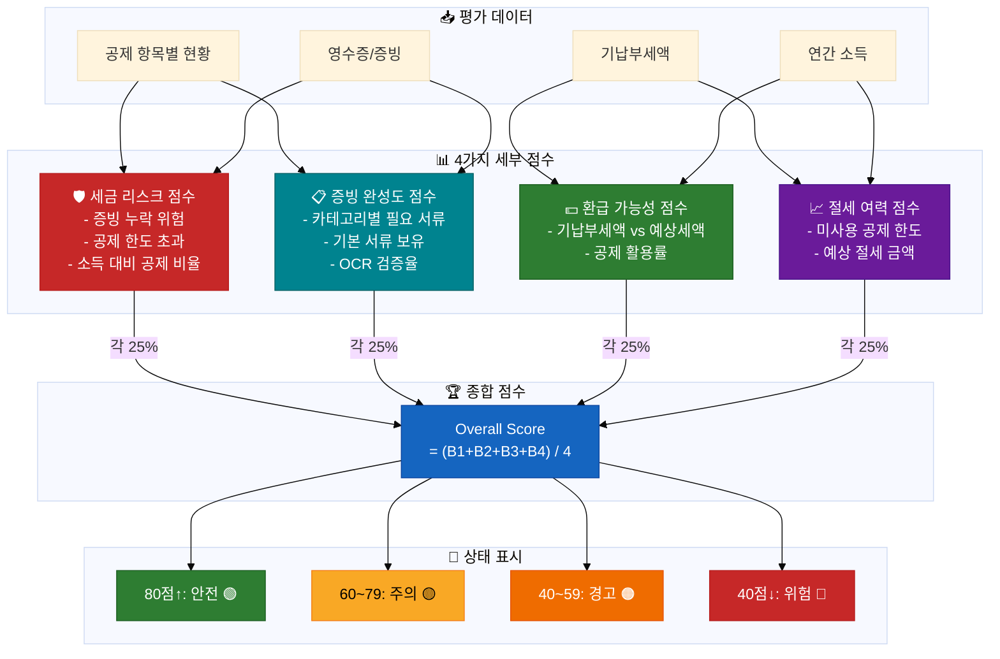

### 세금 리스크 점수 상세

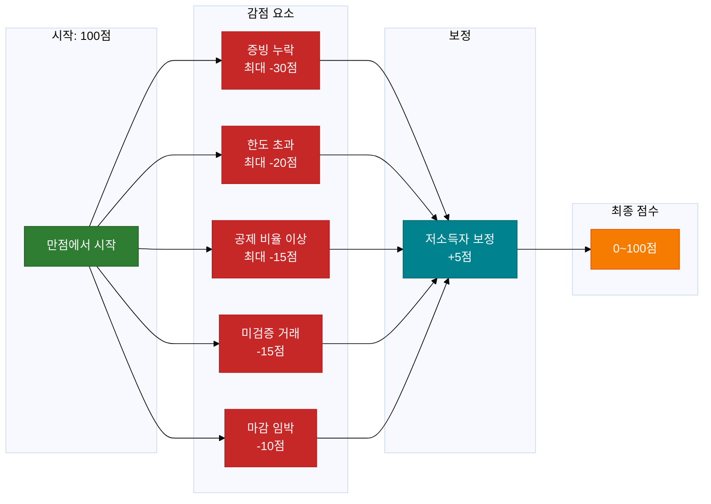

---

## 8. 세액공제 항목별 로직

### 의료비 세액공제

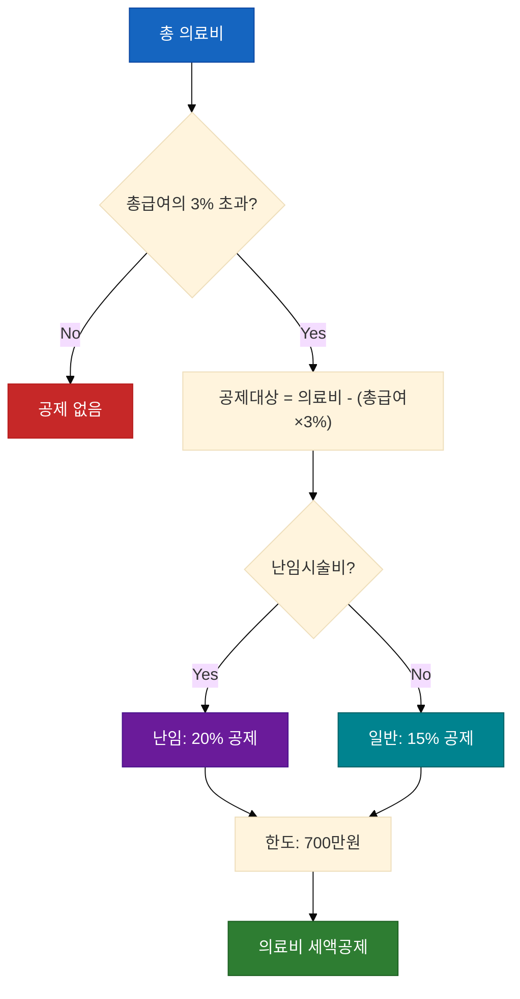

### 교육비 세액공제

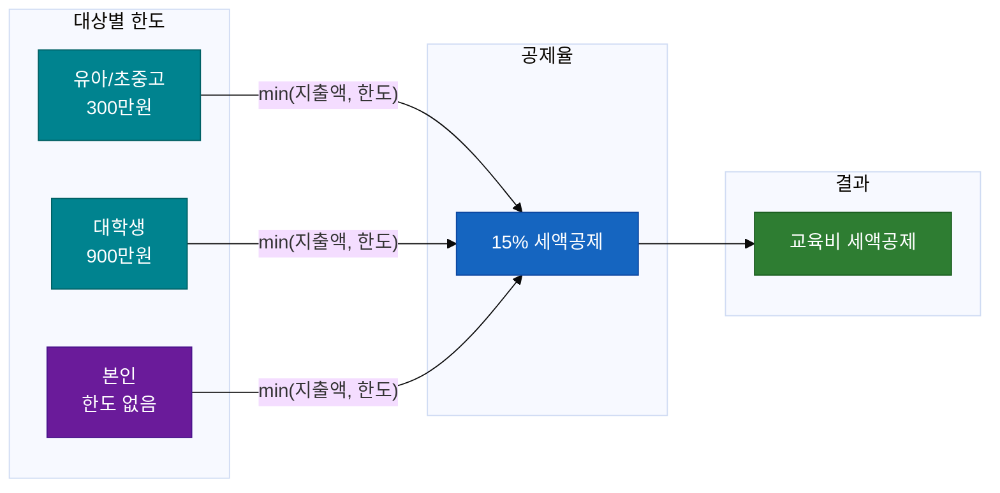

### 연금저축/IRP 세액공제

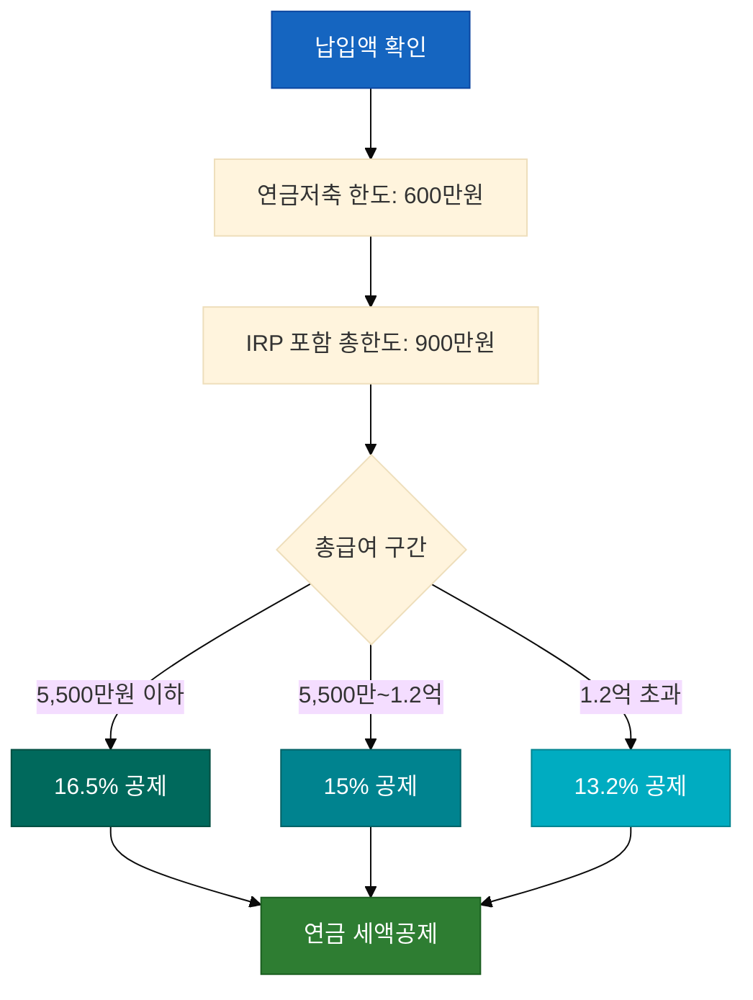

### 기부금 세액공제

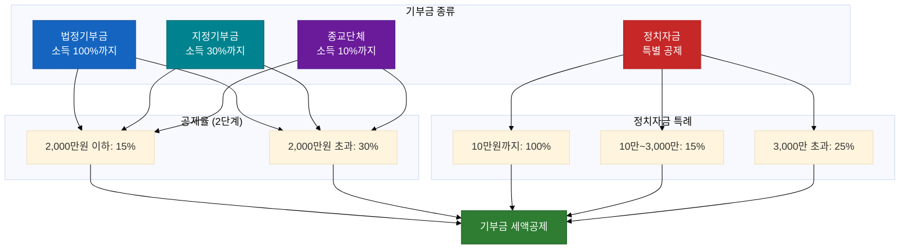

---

## 9. 4대보험 계산

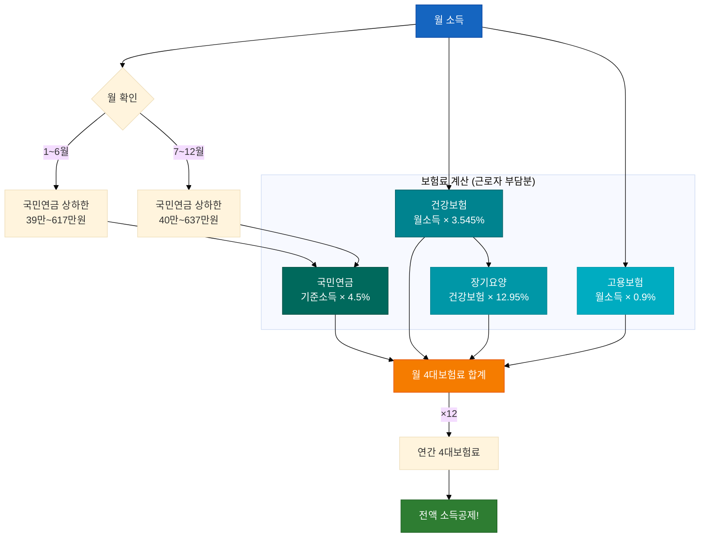

### 4대보험 상하한 (2025년)

| 보험 | 요율 | 상한 | 하한 |
|------|------|------|------|
| 국민연금 | 4.5% | 약 28.6만원 | 약 1.8만원 |
| 건강보험 | 3.545% | 약 450만원 | 약 1만원 |
| 장기요양 | 건보×12.95% | - | - |
| 고용보험 | 0.9% | 없음 | 없음 |

---

## 10. 월세 세액공제

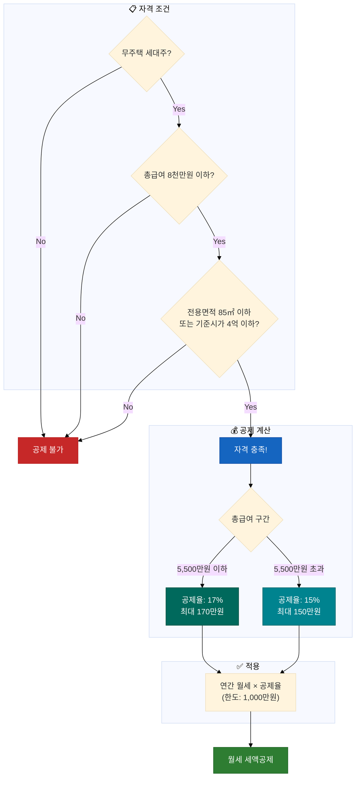

---

## 부록: 전체 세금 계산 함수 관계도

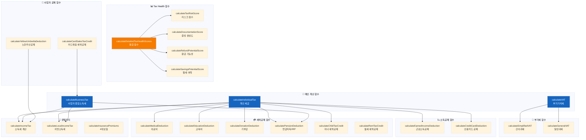

---

## 요약: 핵심 계산 흐름


---

## 색상 범례

| 색상 | 의미 |
|------|------|
| 🔵 **파란색** | 입력/시작점 |
| 🟢 **녹색** | 결과/완료/혜택 |
| 🟠 **주황색** | 중간 계산/주의 |
| 🔴 **빨간색** | 감점/불가/위험 |
| 🟣 **보라색** | 특별 항목/핵심 |
| 🔷 **청록색** | 세부 항목/옵션 |

---

> **참고**: 이 문서는 `src/services/calculators/taxCalculator.js` 코드를 기반으로 작성되었습니다.
> 실제 세금 계산은 개인 상황에 따라 달라질 수 있으니 국세청 또는 세무사에게 확인하세요.

**마지막 업데이트**: 2025-12-01
